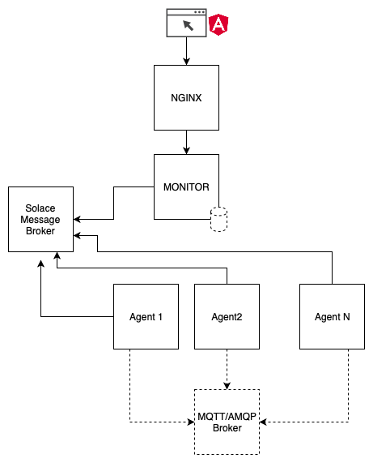

# MESSAGING MONITOR

## Introduction

This project provides AMQP and MQTT messaging protocols test/benchmark GUI.

It uses Solace Pub/Sub+ internally and as a default broker but it can use any other AMQP or MQTT broker. 

## Architecture

## Demo

## Build

### Perquisites

- Java 8+
- Nodejs 10.9.0+

### Command

`./gradlew build buildDocker`

## Run ( example with 1 monitor, 2 agents and Solace Pub/Sub+ (internal broker and as a test broker) )

`docker-compose up`

Application's url :

`http://localhost:8080`

## Run Messaging Monitor front in dev mode 

`cd monitor-front`

`ng serve --proxy-config proxy.conf.json`

Application's url :

`http://localhost:4200`